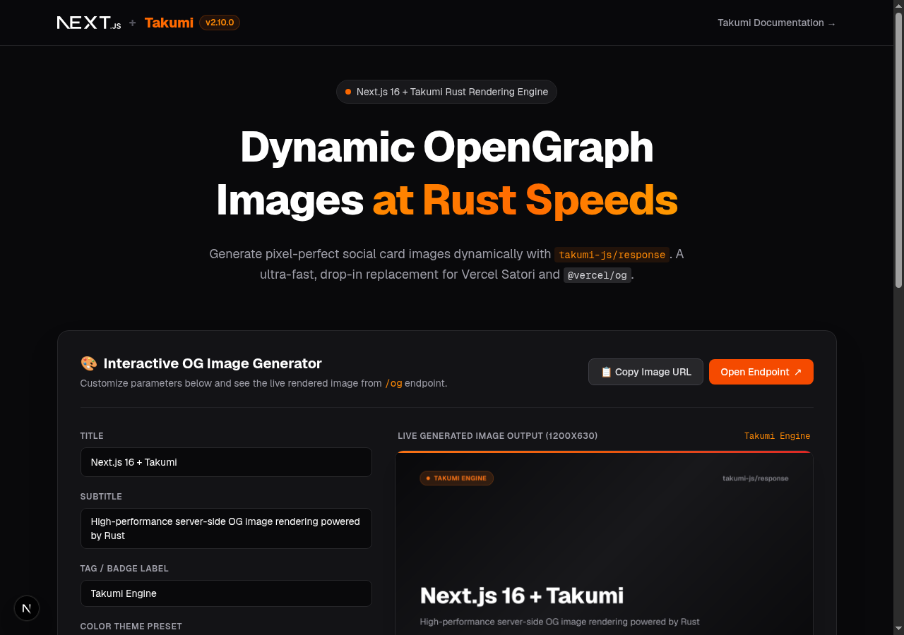

# Next.js 16 + Takumi OG Image Generator

A high-performance social preview (OpenGraph) card generator built with **Next.js 16** (App Router), **React 19**, and **[Takumi](https://takumi.kane.tw/)** (`takumi-js`).

Takumi uses high-performance Rust bindings (`@takumi-rs/core`) to render HTML/JSX into pixel-perfect PNG images with sub-millisecond server-side rendering latency, serving as a drop-in replacement for `@vercel/og` and Satori.

---

## 📸 Preview



---

## ⚡ Features

- **Blistering Fast Rust Canvas**: Sub-millisecond image generation powered by Rust core engine.
- **Drop-in `@vercel/og` Replacement**: Import `ImageResponse` from `takumi-js/response` with compatible API signatures.
- **Dynamic API Endpoint (`/og`)**: Pass custom `title`, `subtitle`, `tag`, and `theme` parameters via query strings.
- **Built-in File Convention (`opengraph-image.tsx`)**: Automatic metadata OpenGraph card generation natively supported by Next.js 16.
- **Interactive Playground**: Real-time live image generation playground on `app/page.tsx`.
- **Multi-Theme Presets**: Includes `dark`, `warm gradient`, `sunset`, `ocean`, and `neon` presets out of the box.

---

## 🚀 Getting Started

This project uses **[pnpm](https://pnpm.io/)** for fast, efficient package management.

### 1. Install Dependencies

```bash
pnpm install
```

### 2. Run Development Server

```bash
pnpm dev
```

Open [http://localhost:3000](http://localhost:3000) in your browser to interact with the live OG image playground.

### 3. Build for Production

```bash
pnpm build
```

### 4. Start Production Server

```bash
pnpm start
```

---

## 🎨 How to Use Takumi Image Generator

### Method 1: Dynamic Route Handler (`app/og/route.tsx`)

Access `/og` with custom parameters:

```bash
http://localhost:3000/og?title=Hello+World&subtitle=Generated+with+Takumi&theme=sunset
```

#### Supported Query Parameters

| Parameter | Type | Default Value | Description |
| :--- | :--- | :--- | :--- |
| `title` | `string` | `"Next.js 16 + Takumi"` | Main title text on the card |
| `subtitle` | `string` | `"High-performance server-side OG image..."` | Subtitle description line |
| `tag` | `string` | `"Takumi Engine"` | Badge label shown at top left |
| `theme` | `string` | `"dark"` | Color preset (`dark`, `gradient`, `sunset`, `ocean`, `neon`) |

#### Implementation Example (`app/og/route.tsx`)

```tsx
import { ImageResponse } from "takumi-js/response";
import { NextRequest } from "next/server";

export function GET(request: NextRequest) {
  const { searchParams } = new URL(request.url);
  const title = searchParams.get("title") || "Next.js 16 + Takumi";

  return new ImageResponse(
    <div
      style={{
        width: "100%",
        height: "100%",
        display: "flex",
        alignItems: "center",
        justifyContent: "center",
        background: "#09090b",
        color: "#ffffff",
      }}
    >
      <h1 style={{ fontSize: 64, fontWeight: "bold" }}>{title}</h1>
    </div>,
    {
      width: 1200,
      height: 630,
    }
  );
}
```

---

### Method 2: Next.js Metadata File Convention (`app/opengraph-image.tsx`)

Next.js 16 automatically picks up `app/opengraph-image.tsx` and serves it for social previews when sharing your site link.

#### Implementation Example (`app/opengraph-image.tsx`)

```tsx
import { ImageResponse } from "takumi-js/response";

export const alt = "Next.js 16 + Takumi OG Image";
export const size = {
  width: 1200,
  height: 630,
};
export const contentType = "image/png";

export default async function Image() {
  return new ImageResponse(
    <div
      style={{
        width: "100%",
        height: "100%",
        display: "flex",
        flexDirection: "column",
        justifyContent: "center",
        alignItems: "center",
        background: "#09090b",
        color: "#ffffff",
      }}
    >
      <h1 style={{ fontSize: 72, fontWeight: "bold", color: "#f97316" }}>
        Takumi + Next.js 16
      </h1>
    </div>,
    {
      ...size,
    }
  );
}
```

---

## 📁 Project Structure

```text
├── app/
│   ├── layout.tsx         # Root layout with site metadata & OpenGraph tags
│   ├── page.tsx           # Interactive OG Playground UI & documentation hero
│   ├── globals.css        # Tailwind CSS v4 setup
│   ├── opengraph-image.tsx# Next.js Metadata OG image convention file
│   └── og/
│       └── route.tsx      # Dynamic endpoint serving customized OG images
├── package.json           # Dependencies (takumi-js, next, react)
├── pnpm-lock.yaml         # Locked pnpm dependency graph
├── README.md              # Project documentation and setup instructions
└── tsconfig.json          # TypeScript configuration
```

---

## 🛠️ Technology Stack

- **Framework**: Next.js 16 (App Router)
- **Image Generation**: `takumi-js` (v2.10.0) powered by `@takumi-rs/core`
- **Styling**: Tailwind CSS v4
- **Language**: TypeScript
- **Package Manager**: `pnpm`

---

## 📖 Learn More & Resources

- [Takumi Official Integration Docs](https://takumi.kane.tw/docs/integration/nextjs)
- [Next.js App Router Metadata Documentation](https://nextjs.org/docs/app/building-your-application/optimizing/metadata)

